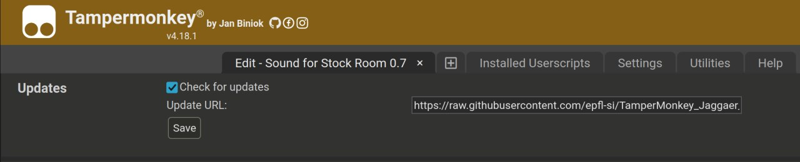

# Jaggaer Kiosk Userscript (TamperMonkey)

This userscript allow your browser to play song when you have an
issue on the Jaggaer Kiosk web page.

## Prerequisite

Install the [TamperMonkey](https://www.tampermonkey.net) on
your browser. It might work with other userscript managers
([Violentmonkey](https://violentmonkey.github.io/), GreaseMonkey) but they have
not been tested.

## Install the userscript

1. Open TampeMonkey dashboard
1. Click on the "Utilities" tab
1. Use "Install from URL" with: https://raw.githubusercontent.com/epfl-si/TamperMonkey_Jaggaer_Kiosk/master/Sound_for_stock_Room.js
1. Click "Install"
1. Validate and install the script
1. Check if the script is with the status enabled in "Installed Userscripts"
1. On the "Settings" tab, Userscript Update, set the "Check Interval" to Every Day

## Auto-update

1. Open TamperMonkey dashboard
1. Go to "Installed Userscripts"
1. Click on "Sound for Stock Room"
1. Go to the "Settings" tab
1. In the "Updates" section, check the "Check for update" option
1. From now, it will auto-update itself if the global update settings is on.
   One can also go to TamperMonkey icon > Utilities > Check for userscript updates

